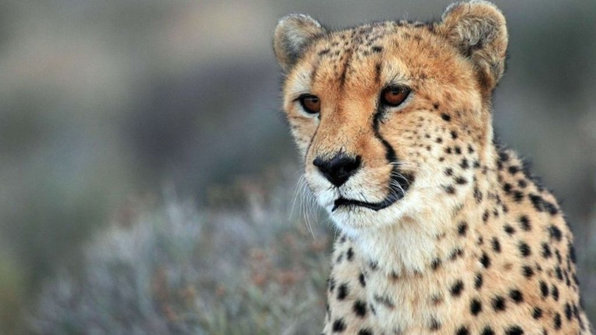

# Cheetah

The cheetah is the world's fastest land mammal. With acceleration that would leave most automobiles in the dust, a cheetah can go from 0 to 60 miles an hour in only three seconds. These big cats are quite nimble at high speed and can make quick and sudden turns in pursuit of prey.

### Speed and Hunting

Before unleashing their speed, cheetahs use exceptionally keen eyesight to scan their grassland environment for signs of prey—especially antelope and hares. This big cat is a daylight hunter that benefits from stealthy movement and a distinctive spotted coat that allows it to blend easily into high, dry grasses.

When the moment is right a cheetah will sprint after its quarry and attempt to knock it down. Such chases cost the hunter a tremendous amount of energy and are usually over in less than a minute. If successful, the cheetah will often drag its kill to a shady hiding place to protect it from opportunistic animals that sometimes steal a kill before the cheetah can eat. Cheetahs need only drink once every three to four days.

### Breeding and Population

Female cheetahs typically have a litter of three cubs and live with them for one and a half to two years. Young cubs spend their first year learning from their mother and practicing hunting techniques with playful games. Male cheetahs live alone or in small groups, often with their littermates.

Most wild cheetahs are found in eastern and southwestern Africa. These populations are under pressure as the wide-open grasslands they favor are disappearing at the hands of human settlers.

